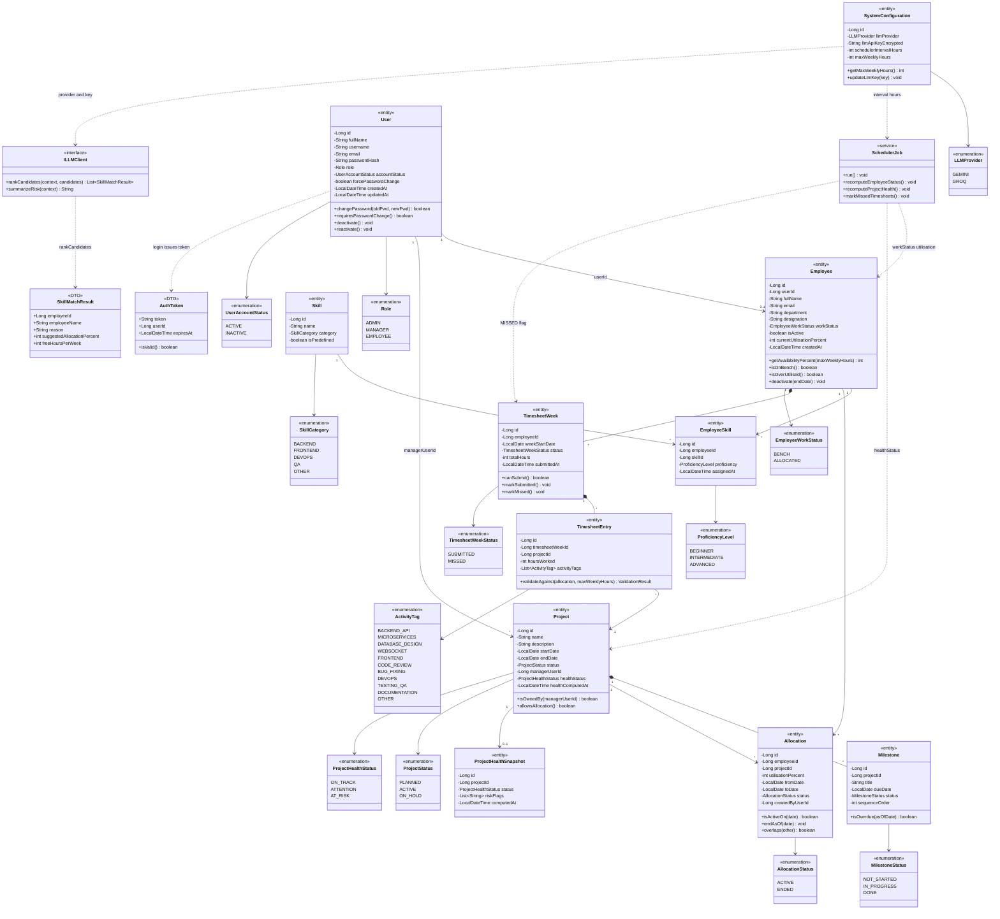

# PRM Tool — Master Class Diagram

**Purpose:** One **BRD-aligned** domain class diagram. **Only** what [PRM_BRD.md](../../../requirements/PRM_BRD.md) §3–§4 requires (Admin-only account creation).

**Live view:** Open [class-diagram.html](./class-diagram.html) in a browser (Mermaid renders in-page).

**Export:** [class-diagram.mmd](./class-diagram.mmd) → [mermaid.live](https://mermaid.live) (Menu → Open).

**Implementation (Python):** Services, repositories, REST API, and console layout — [DESIGN.md](../../architecture/DESIGN.md).

---

## Merge summary (your diagram vs BRD)

| Topic | Earlier draft | BRD / merged result |
|-------|------------------------------|---------------------|
| Skills | `Skill` owned by `Employee` (composition) | **`Skill` + `EmployeeSkill` join** (Screen 3.1.4) |
| Timesheet | `Timesheet` | **`TimesheetWeek`** (week is the aggregate, Screen 5) |
| Project manager | `managerId` | **`managerUserId`** → `User` (Admin may not have Employee profile) |
| Project health | `Project.computeHealth()` on entity | **Scheduler / rule engine** updates `healthStatus`; no method on entity |
| Project status | Included `COMPLETED` | **Removed** — BRD only PLANNED, ACTIVE, ON_HOLD |
| User status | `isActive` only | **`UserAccountStatus`** ACTIVE / INACTIVE (Screen 3.4.2) |
| User login | `login()` on `User` | **Removed from entity** — application `AuthService` (implementation) |
| `AuthToken` | On diagram | **Kept as «DTO»** — login outcome (BRD Screen 1); not a domain table |
| AI | `AIService` class | **`ILLMClient` «interface»** + `SkillMatchResult` «DTO» (BRD §4.1 AI scope) |
| Risk output | `RiskSummary` entity | **`summarizeRisk()` returns `String`** — no separate persisted entity in BRD |
| Scheduler | `SchedulerJob` | **Kept as «service»** — BRD §4.1 background job |
| Enums on diagram | Yes | **Kept** — all BRD enumerations linked to attributes |
| `ProjectHealthSnapshot` | Missing | **Added** — health flags / snapshot (BRD project detail) |
| `fullName` on `User` | Missing | **Added** — Create User Account (Screen 3.4.1) |

---

## Master class diagram

Same content as [class-diagram.html](./class-diagram.html). Copy from `class-diagram.mmd` or the block below (first line = `classDiagram`).

> **BRD note:** `workStatus`, `healthStatus`, and MISSED timesheets are **written by `SchedulerJob`** (§4.1), not by entity methods on `Project` or `Employee`.

---

## BRD coverage

| BRD area | Classes on diagram |
|----------|-------------------|
| Auth & users (Screens 1–2, 3.4) | `User`, `AuthToken` «DTO», `Role`, `UserAccountStatus` |
| Employees & skills (3.1) | `Employee`, `Skill`, `EmployeeSkill`, enums |
| Projects & milestones (3.2, 4.3) | `Project`, `Milestone`, `ProjectHealthSnapshot` |
| Allocations (4.2) | `Allocation` |
| Timesheets (5.x) | `TimesheetWeek`, `TimesheetEntry`, `ActivityTag` |
| System config (3.5) | `SystemConfiguration`, `LLMProvider` |
| AI & scheduler (§4.1) | `ILLMClient`, `SkillMatchResult`, `SchedulerJob` |

**Explicitly not on this diagram (out of BRD domain / implementation detail):** `AuthService`, repositories, console menus, timesheet approval, web UI, `RiskSummary` table, `COMPLETED` project status.

---

## Key design rules

1. **User ≠ Employee** — optional `0..1` link; Admin may have User only.
2. **Skills** — reusable `Skill`; assignment via `EmployeeSkill` with proficiency.
3. **Manager** — `Project.managerUserId` references `User`, not `Employee`.
4. **Health** — scheduler updates `Project.healthStatus`; optional `ProjectHealthSnapshot` for flags/history.
5. **AI risk** — plain-English **string** from LLM, not a stored `RiskSummary` entity.

---

## Changelog

| Date | Change |
|------|--------|
| 2026-06-03 | Domain-only master diagram |
| 2026-06-03 | Merged domain diagram: enums + scheduler + LLM; BRD corrections applied |
| 2026-06-03 | **BRD V3:** no model change; moved to `docs/diagrams/class/` |
