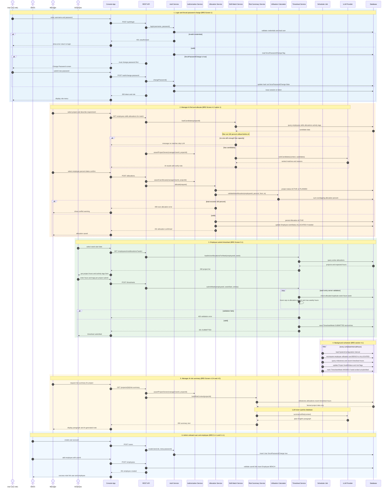

# PRM Tool — Master Sequence Diagram

**Purpose:** One **BRD-aligned** sequence diagram ([PRM_BRD.md](../../../requirements/PRM_BRD.md)). Early SVG drafts may live in `archive/`.

**Live view:** [sequence-diagram.html](./sequence-diagram.html) — **six panels**, each with its own actors (Console, REST API, etc.) at the top of that section.

**Export:** Copy one § block from [sequence-diagram.mmd](./sequence-diagram.mmd) or the HTML script into [mermaid.live](https://mermaid.live).

**Reading order:** §1 Login → §2 Admin → §3–§4 Manager (allocate, then risk) → §5 Employee → §6 Scheduler.

---

## Why Admin was not in the first version (and what we did now)

| Reason | Explanation |
|--------|-------------|
| **Same technical pattern** | Admin screens (3.1, 3.2, 3.4, 3.5) are all **Console → REST → service → DB**. Drawing every CRUD screen would repeat the same arrows and make one diagram unreadable. |
| **BRD emphasis** | §4.1 highlights **AI matching**, **allocation rules**, **timesheets**, and the **scheduler** — not Admin data entry. |
| **Admin is not a “special” runtime path** | Admin does not call the LLM or the scheduler as a user; they only **configure** the system (Screen 3.5). |
| **What reviewers need in one diagram** | Cross-role **auth** plus the **three distinctive flows** (Manager + Employee + background). |

**Now included:** a **short §6 Admin onboard** (Create User + Add Employee — BRD Screen 3.4.1 + 3.1.1), because your question is valid for completeness. Other Admin menus (projects, milestones, config) still follow the same pattern and are listed in the catalogue below.

---

## Merge: your 4 SVGs vs master diagram

| Your SVG | Covered in master? | Added / improved in merge |
|----------|-------------------|---------------------------|
| `seq_login_password.svg` | §1 | Generic **User** actor; invalid login **alt**; **PATCH/change password** branch; token + role menu |
| `seq_allocate_resource_ai.svg` | §2 | **GET** load candidates; capacity **filter** note; **409** over-allocation **alt**; **ALLOCATED** status update |
| `seq_timesheet_submit.svg` | §3 | **GET** allocations for week; per-project form; **loop** server validation; persist week + entries |
| `seq_scheduler_risk_summary.svg` | §4 + **§5** | Scheduler **MISSED** flag; health from milestones + hours; **§5 AI risk summary** (was missing before) |
| *(none)* Admin CRUD | **§6** (short) | Create user + add employee only |

---

## Master sequence diagram (6 BRD sections)

> **Note:** REST paths are illustrative (BRD does not mandate URLs). Behaviour matches BRD screens and validation rules.

---

## BRD coverage catalogue

| § | Flow | BRD |
|---|------|-----|
| 1 | Login + change password | Screen 1 |
| 2 | Admin create user + add employee | Screen 3.4.1, 3.1.1 |
| 3 | Manager AI skill match + allocate + utilisation guard | Screen 4.2, “How the AI Works” |
| 4 | Manager AI risk summary | Screen 4.3 [A], 4.5 |
| 5 | Employee submit timesheet | Screen 5.1 |
| 6 | Background scheduler | §4.1 |

**Same pattern, not drawn separately:** Admin manage projects/milestones (3.2), view allocations (3.3), system config (3.5), Manager dashboard (4.1), direct allocate without AI (4.2 opt 2), end allocation (4.2 opt 3). **V3:** no Sign Up — all accounts via §2 only.

---

## Changelog

| Date | Change |
|------|--------|
| 2026-06-03 | Initial master sequence diagram |
| 2026-06-03 | Merged Claude SVG flows; added §5 risk summary, §6 Admin onboard, enhanced §1–§4 |
| 2026-06-03 | **BRD V3:** §6 is sole account-creation path; Sign Up removed from catalogue |
| 2026-06-03 | Reordered §1–§6; split HTML into six diagrams with per-section actors |
